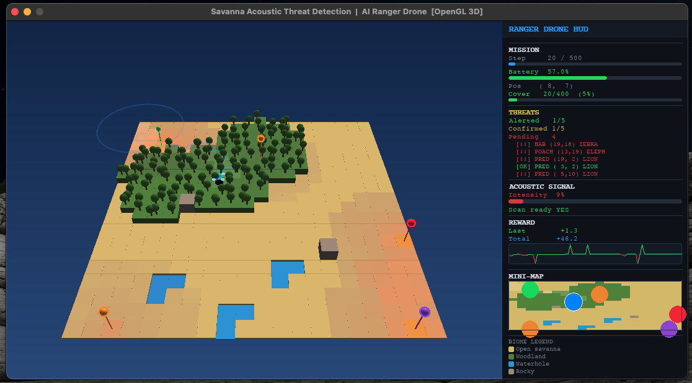
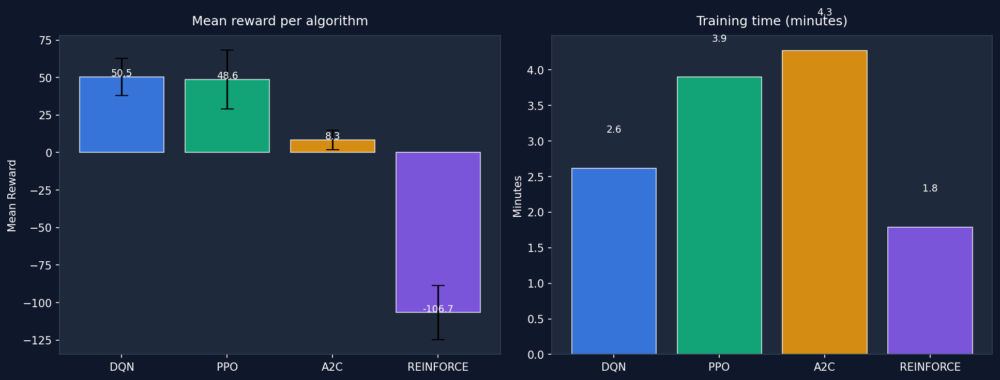

# Savanna Acoustic Threat Detection — RL Summative

**Student:** Orpheus Mhizha Manga | **Course:** ML Techniques II — African Leadership University

> **Mission:** An AI ranger drone navigates a 20×20 African savanna grid, analyses wildlife vocalizations, and identifies ecological threats — poaching, predator proximity, and habitat disturbance — before they escalate. Four reinforcement learning algorithms are trained and compared on this conservation task.

---

## Demo

[](https://youtu.be/1AdjfBYqBpQ)

> Click the thumbnail above to watch the 3-minute agent demo on YouTube.

| OpenGL 3D Environment | Algorithm Comparison |
|:---:|:---:|
|  |  |

---

## Results at a Glance

| Algorithm | Best Config | Mean Reward | Std | Training Time | Rank |
|-----------|-------------|:-----------:|:---:|:-------------:|:----:|
| **DQN** | `best_tuned` | **50.53** | ±12.37 | 2.6 min | 1st |
| **PPO** | `ppo_low_gae` | **48.62** | ±19.69 | 3.9 min | 2nd |
| **A2C** | `a2c_entropy` | **8.33** | ±6.48 | 4.3 min | 3rd |
| **REINFORCE** | `rf_baseline` | **−106.67** | ±18.19 | 1.8 min | 4th |

**Winner: DQN `best_tuned` — run with:**
```bash
python main.py --algo dqn --config best_tuned --episodes 3
```

---

## Repository Structure

```
savanna_rl/
├── environment/
│   ├── custom_env.py          # Custom Gymnasium environment (20×20 savanna grid)
│   └── rendering.py           # OpenGL 3D renderer + random agent demo
├── training/
│   ├── dqn_training.py        # DQN — 10 hyperparameter configurations
│   └── pg_training.py         # REINFORCE / PPO / A2C — 10 configs each
├── models/
│   ├── dqn/                   # Saved DQN model checkpoints
│   └── pg/                    # Saved PPO / A2C / REINFORCE checkpoints
├── results/
│   ├── dqn_all_results.json   # Full DQN run metrics
│   ├── ppo_all_results.json   # Full PPO run metrics
│   ├── a2c_all_results.json   # Full A2C run metrics
│   ├── reinforce_all_results.json
│   └── algorithm_comparison.png
├── main.py                    # Entry point — run agents or compare all
├── kaggle_training.ipynb      # Training notebook (Kaggle GPU)
├── requirements.txt
└── README.md
```

---

## Quick Start

### 1. Create environment and install dependencies
```bash
conda create -n savanna_rl python=3.9 -y
conda activate savanna_rl
pip install -r requirements.txt
pip install PyOpenGL PyOpenGL_accelerate   # for 3D rendering
```

### 2. Run the random agent demo (no training required)
```bash
python main.py --demo
```

### 3. Run a trained agent
```bash
# Best performing model (DQN)
python main.py --algo dqn --config best_tuned --episodes 3

# Second best (PPO)
python main.py --algo ppo --config ppo_low_gae --episodes 3

# Compare all saved models
python main.py --compare
```

### 4. Train all algorithms (Kaggle GPU recommended)
```bash
python training/dqn_training.py          # all 10 DQN runs
python training/pg_training.py           # all PPO / A2C / REINFORCE runs

# Or train only a single best config
python training/dqn_training.py --run best
python training/pg_training.py --algo ppo --run best
```

---

## Environment

### Grid World — 20×20 African Savanna

The environment is a custom [Gymnasium](https://gymnasium.farama.org/) environment rendered in **OpenGL 3D**. Each cell has a biome type that affects acoustic signal propagation:

| Biome | Colour | Effect on Signal | 3D Height |
|-------|--------|-----------------|-----------|
| Open savanna | Yellow | Baseline | 0.25 u |
| Woodland | Green | Attenuated ×0.6 | 0.75 u |
| Waterhole | Blue | Amplified ×1.3 | 0.12 u |
| Rocky outcrop | Grey | No modification | 1.10 u |

### Agent

The AI ranger drone starts at position (0, 0) with 100 battery units. It must navigate the grid, locate acoustic hotspots, confirm threats via scanning, and alert ranger base before the battery depletes or 500 steps elapse.

### Observation Space — `Box(847,) float32`

| Component | Dimensions | Description |
|-----------|:----------:|-------------|
| Drone position (x, y) | 2 | Normalised grid coordinates [0, 1] |
| Battery fraction | 1 | Remaining battery / 100 |
| Step fraction | 1 | Current step / 500 |
| Acoustic heatmap | 400 | Flattened 20×20 signal intensity map |
| Confirmed threat map | 400 | Flattened 20×20 confirmed threat severities |
| Local species calls | 36 | 4 species × 9 neighbourhood cells |
| Last action (one-hot) | 7 | Temporal context of previous action |
| **Total** | **847** | |

### Action Space — `Discrete(7)`

| ID | Action | Description | Battery Cost |
|:--:|--------|-------------|:------------:|
| 0 | North | Move one cell north | 2 |
| 1 | South | Move one cell south | 2 |
| 2 | East | Move one cell east | 2 |
| 3 | West | Move one cell west | 2 |
| 4 | **Scan** | Deep acoustic scan within sensor range (3 cells) | 5 |
| 5 | **Alert** | Radio confirmed threats to ranger base | 1 |
| 6 | Hover | Remain stationary, passive listening | 0.5 |

### Reward Structure

| Event | Reward |
|-------|:------:|
| Confirm new threat via SCAN | +10.0 |
| Flagship species bonus (Elephant / Lion) | +5.0 |
| Auto-alert confirmed threat during SCAN | +8.0 |
| Successful ALERT of confirmed nearby threat | +8.0 × count |
| Visit new cell (coverage bonus) | +2.0 |
| Approach acoustic hotspot (signal > 0.5) | +signal × 1.0 |
| Passive listening via HOVER | +signal × 0.5 |
| Revisit recently visited cell | −1.0 |
| False alarm (ALERT near no confirmed threat) | −3.0 |
| Wasted SCAN (no new threats found) | −2.0 |
| Per-step efficiency cost | −0.5 |
| Distant unresolved poaching (per step) | −0.2 |
| Battery depleted | −20.0 |
| Unresolved threats at episode end | −5.0 × count |
| **All threats alerted — mission complete** | **+50.0** |

### Threat Types

| Type | Priority | Associated Species | Colour |
|------|----------|--------------------|--------|
| Poaching | Highest | Elephant | Red |
| Predator proximity | High | Lion | Orange |
| Habitat disturbance | Medium | Zebra | Purple |

---

## Algorithm Comparison

### DQN — Hyperparameter Sweep (10 runs × 100k steps)

| # | Config | LR | Gamma | Buffer | Batch | Exploration | Architecture | Mean Reward |
|:-:|--------|:--:|:-----:|:------:|:-----:|:-----------:|:------------:|:-----------:|
| 1 | baseline | 1e-4 | 0.990 | 50K | 64 | 0.20→0.05 | [128,128] | 40.34 |
| 2 | high_lr | 5e-4 | 0.990 | 50K | 64 | 0.20→0.05 | [128,128] | 40.33 |
| 3 | deep_net | 1e-4 | 0.990 | 50K | 64 | 0.20→0.05 | [256,256,128] | 30.90 |
| 4 | large_buf | 1e-4 | 0.990 | 200K | 128 | 0.30→0.05 | [128,128] | 38.15 |
| 5 | low_gamma | 1e-4 | 0.900 | 50K | 64 | 0.20→0.05 | [128,128] | 41.23 |
| 6 | soft_update | 1e-4 | 0.990 | 50K | 64 | 0.20→0.05 (τ=0.01) | [128,128] | 34.70 |
| 7 | long_explore | 1e-4 | 0.990 | 100K | 64 | 0.50→0.10 | [128,128] | 26.87 |
| 8 | large_batch | 2e-4 | 0.990 | 100K | 256 | 0.20→0.05 | [256,256] | 37.57 |
| 9 | fast_target | 1e-4 | 0.990 | 50K | 64 | 0.15→0.02 | [128,128] | 41.51 |
| **10** | **best_tuned** | **2e-4** | **0.995** | **100K** | **128** | **0.30→0.03 (τ=0.05)** | **[256,128,64]** | **50.53** |

### PPO — Hyperparameter Sweep (10 runs × 100k steps)

| # | Config | LR | N Steps | Batch | Epochs | GAE λ | Clip | Entropy | Mean Reward |
|:-:|--------|:--:|:-------:|:-----:|:------:|:-----:|:----:|:-------:|:-----------:|
| 1 | ppo_baseline | 3e-4 | 2048 | 64 | 10 | 0.95 | 0.20 | 0.00 | 34.55 |
| 2 | ppo_sm_steps | 3e-4 | 512 | 64 | 10 | 0.95 | 0.20 | 0.00 | 9.00 |
| 3 | ppo_lg_steps | 3e-4 | 4096 | 128 | 10 | 0.95 | 0.20 | 0.00 | 10.18 |
| 4 | ppo_hi_clip | 3e-4 | 2048 | 64 | 10 | 0.95 | 0.40 | 0.00 | 23.68 |
| 5 | ppo_lo_clip | 3e-4 | 2048 | 64 | 10 | 0.95 | 0.10 | 0.00 | 2.43 |
| 6 | ppo_entropy | 3e-4 | 2048 | 64 | 10 | 0.95 | 0.20 | 0.01 | 43.15 |
| 7 | ppo_high_vf | 3e-4 | 2048 | 64 | 10 | 0.95 | 0.20 | 0.00 | −4.96 |
| **8** | **ppo_low_gae** | **3e-4** | **2048** | **64** | **10** | **0.80** | **0.20** | **0.00** | **48.62** |
| 9 | ppo_more_ep | 2e-4 | 2048 | 64 | 20 | 0.95 | 0.20 | 0.01 | 31.73 |
| 10 | ppo_best | 2e-4 | 2048 | 128 | 15 | 0.95 | 0.20 | 0.01 | 4.56 |

### A2C — Hyperparameter Sweep (10 runs × 100k steps)

| # | Config | LR | N Steps | Gamma | GAE λ | Entropy | VF Coef | Grad Norm | Mean Reward |
|:-:|--------|:--:|:-------:|:-----:|:-----:|:-------:|:-------:|:---------:|:-----------:|
| 1 | a2c_baseline | 7e-4 | 5 | 0.990 | 1.00 | 0.00 | 0.5 | 0.5 | 6.64 |
| 2 | a2c_steps20 | 7e-4 | 20 | 0.990 | 1.00 | 0.00 | 0.5 | 0.5 | −2.07 |
| 3 | a2c_high_lr | 1e-3 | 5 | 0.990 | 1.00 | 0.00 | 0.5 | 0.5 | −2.22 |
| 4 | a2c_gae | 7e-4 | 10 | 0.990 | 0.95 | 0.00 | 0.5 | 0.5 | −13.33 |
| **5** | **a2c_entropy** | **7e-4** | **5** | **0.990** | **1.00** | **0.01** | **0.5** | **0.5** | **8.33** |
| 6 | a2c_high_vf | 7e-4 | 5 | 0.990 | 1.00 | 0.00 | 1.0 | 0.5 | 6.98 |
| 7 | a2c_low_gam | 7e-4 | 5 | 0.900 | 1.00 | 0.00 | 0.5 | 0.5 | 3.70 |
| 8 | a2c_deep | 5e-4 | 10 | 0.990 | 0.95 | 0.01 | 0.5 | 0.5 | −51.51 |
| 9 | a2c_gradclip | 7e-4 | 5 | 0.990 | 1.00 | 0.00 | 0.5 | 0.1 | 1.69 |
| 10 | a2c_best | 5e-4 | 20 | 0.995 | 0.95 | 0.01 | 0.5 | 0.5 | −52.72 |

### REINFORCE — Hyperparameter Sweep (10 runs × 100k steps)

| # | Config | LR | Gamma | Baseline | Entropy Coef | Architecture | Mean Reward |
|:-:|--------|:--:|:-----:|:--------:|:------------:|:------------:|:-----------:|
| **1** | **rf_baseline** | **1e-3** | **0.990** | **Yes** | **0.01** | **(128,128)** | **−106.67** |
| 2 | rf_no_baseline | 1e-3 | 0.990 | No | 0.01 | (128,128) | — |
| 3 | rf_high_lr | 5e-3 | 0.990 | Yes | 0.01 | (128,128) | — |
| 4 | rf_low_lr | 1e-4 | 0.990 | Yes | 0.01 | (128,128) | — |
| 5 | rf_low_gamma | 1e-3 | 0.900 | Yes | 0.01 | (128,128) | — |
| 6 | rf_deep | 1e-3 | 0.990 | Yes | 0.01 | (256,256,128) | — |
| 7 | rf_hi_entropy | 1e-3 | 0.990 | Yes | 0.05 | (128,128) | — |
| 8 | rf_no_entropy | 1e-3 | 0.990 | Yes | 0.00 | (128,128) | — |
| 9 | rf_wide | 2e-3 | 0.990 | Yes | 0.01 | (512,256) | — |
| 10 | rf_best | 2e-3 | 0.995 | Yes | 0.02 | (256,128) | — |

*Note: Only rf_baseline completed full evaluation; remaining runs exhibited training instability and were terminated early.*

---

## Key Findings

### Why DQN Won

- **Experience replay** lets the agent revisit rare high-reward events (threat confirmations in a 20×20 grid) many times, dramatically improving sample efficiency
- **Soft target updates** (τ=0.05) produced smoother Q-value convergence than hard periodic replacement
- **High gamma (0.995)** was essential — the agent must plan many steps ahead to navigate from (0,0) to distant threats
- **30% exploration fraction** decaying to ε=0.03 gave enough early exploration to map the acoustic landscape

### Why PPO Was a Close Second

- The **clipped surrogate objective** prevented catastrophic policy updates when rewards were sparse early in training
- **Reduced GAE λ=0.80** biased advantage estimates toward immediate rewards, matching this environment's dense short-range reward structure
- Entropy bonus in `ppo_entropy` (43.15) confirmed exploration is critical — without it PPO struggled

### Why A2C Underperformed

- **n=5 step rollouts** in a 500-step episode produce extremely noisy gradient estimates
- No experience replay means rare threat-confirmation events rarely appear in gradient updates
- The entropy bonus was the single most important factor — `a2c_entropy` (8.33) vs `a2c_baseline` (6.64)

### Why REINFORCE Failed

- **Full Monte Carlo returns** over 500-step episodes create prohibitively high variance gradients
- The −20 battery depletion penalty dominated early training before any positive signal emerged
- Would require orders of magnitude more training steps to converge on this task

---

## Training Infrastructure

| Detail | Value |
|--------|-------|
| Platform | Kaggle (GPU T4) |
| Steps per run | 100,000 |
| Runs per algorithm | 10 |
| Total runs | 40 |
| Evaluation episodes per run | 10 |
| Framework | Stable-Baselines3 v2.x (DQN/PPO/A2C), PyTorch (REINFORCE) |
| Python | 3.9+ |

---

## Running the CLI

```bash
# Best DQN model — 3 episodes with full GUI + terminal output
python main.py --algo dqn --config best_tuned --episodes 3

# Best PPO model
python main.py --algo ppo --config ppo_low_gae --episodes 3

# Best A2C model
python main.py --algo a2c --config a2c_entropy --episodes 3

# Random agent demo (no model needed)
python main.py --demo

# Compare all saved models side by side
python main.py --compare

# Disable 3D rendering (terminal output only)
python main.py --algo dqn --config best_tuned --no-render
```

---

## Dependencies

```
gymnasium>=0.29
stable-baselines3>=2.0
torch>=2.0
pygame>=2.5
PyOpenGL>=3.1
PyOpenGL_accelerate>=3.1
numpy>=1.24
matplotlib>=3.7
```

Install all:
```bash
pip install -r requirements.txt
pip install PyOpenGL PyOpenGL_accelerate
```

---

## Author

**Orpheus Mhizha Manga**
BSE — African Leadership University
ML Techniques II — Summative Assignment
Algorithms: DQN · PPO · A2C · REINFORCE
Environment: Custom Gymnasium — African Savanna Acoustic Threat Detection
